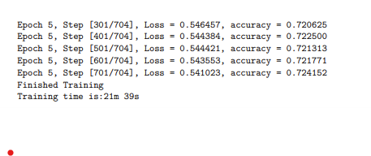
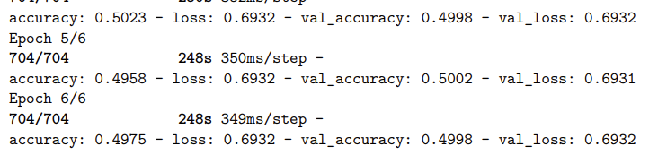

# Pytorch vs TensorFlow

## Johdanto
Tehtävänä oli vertailla Pytorchin ja TensorFlown kirjastojen koulutusta ja miten nämä kaksi eroavat toisistaan.

Molemmat neuroverkot koulutettiin seuraaville perusteilla:
-   Kuvakoko 224x224
-   Esikäsittelyn parametrit
    -   Random flip 50%
    -   Random rotation +/- 30 (astetta)
    -   Ei normalisointia: 32
-   Neuroverkon parametrit:
    -   Conv_Blocks 32 / 64 / 128 kanavaa
        -   Kernelin koko 3x3 / stride = 1 / no padding
        -   Aktivointi = ReLu
        -   Max Pooling
-   Learning Rate: 0.001
-   Koulutus Epochien lukumäärä: 6
-   Ajoympäristö: GPU/Cuda

Tehtävässä käytetyt Notebookit:

TODO LAITA NOTEBOOKIT TÄHÄN [ ]

## Vertailu

Kahden kirjaston välillä verrattiin seuraavia asioita:
-   Koulutukseen kulunutta aikaa
-   Training Loss/Accuracy
-   Validation Loss/Accuracy
-   Vaadittua koodin määrää

### Koulutukseen kulunut aika

Koulutuksen kesto kuudella Epoch:lla oli:
-   Pytorch = n. 22min
-   TensorFlow = n. 24min

Yhden koulutuskierroksen (Epoch) kesto:
-   Pytorch = 3.5 min
-   Tensorflow = 4.1 min
  

.

Kuva 1 Pytorch koulutuksen kesto:

 

Kuva 2 TensorFlow koulutuksen kesto: (Aika laskettu: s * 6 / 60)

### Training Loss/Accuracy 

Koulutuksen aikana tapahtuva tarkkuuden (Accuracy) nousu:
- Pytorch: 0.508 ... 0.724

- TensorFlow: 0.531 ... **0.497**

Koulutuksen aikana tapahtuva menetyksen (Loss) lasku:
- Pytorch: 0.701 ... 0.541

- TensorFlow: 0.698 ... **0.693**

Päätelmät koulutuksen eroista:

-   Pytorchin tarkkuus on todennäköisesti tarkempi, koska sen augmentointi on parempaa kuin TF Kerasilla
-   Pytorch saattaa käyttää Adam oppimisnopeutta paremmin kuin Keras
-   Arkkitehtuurin alustuksessa voi olla eroavaisuuksia, jotka vaikuttaa lopputulokseen

### Validation Loss/Accuracy
Loss:
- Pytorch Loss: (Tiedostossa ei lasketa Validation Loss)
- TensorFlow Loss: 0.693

Accuracy:
- Pytroch Accuracy: 0.762
- TensorFlow Accuracy: 0.499

### Vaadittu koodin määrä

Kokonaisuudessaan koodien määrä on suhteellisen sama.

TF.keras ainakin silmäilyn perusteella vaatii vähemmän itse koodausta mallin kouluttamista varten verrattean Pytorchiin.

Kyseiset asiakirjat eivät käsittele aihetta täysin samalla tavalla, joten nämä voivat tuoda erilaisuutta koodin kokoon.

